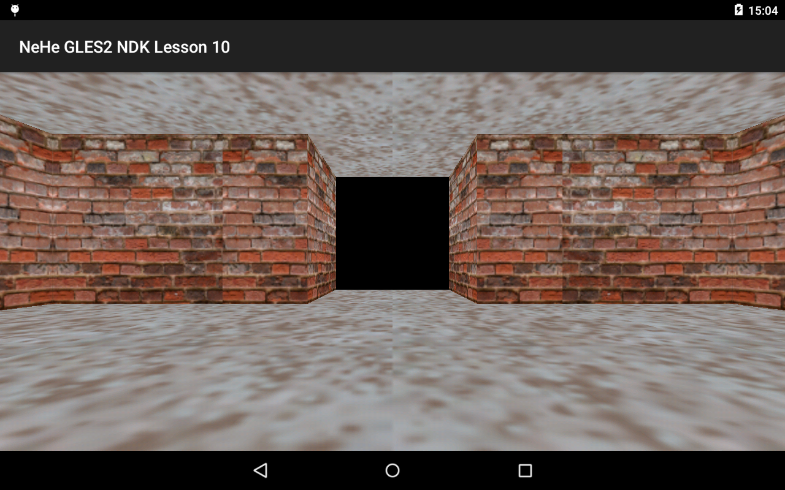

Lesson 10
=========

I'm writing this 10 years later. Whew, what a ride!
I never noticed that I had failed to write a proper README.md to this, so I can't say much in the
evolution of code, but I can say that this lesson was pivotal to what came later - several games, 
still using bits and pieces originally written for this very lesson.

All those many years later, with working in the games industry, learning Vulkan, and getting back to
the basics as I write µGLy (my OpenGL ES 1.0 CL implementation). There was a lot if details I missed
on my first pass and on the maintenance I gave over the years and I intend to fix it now

